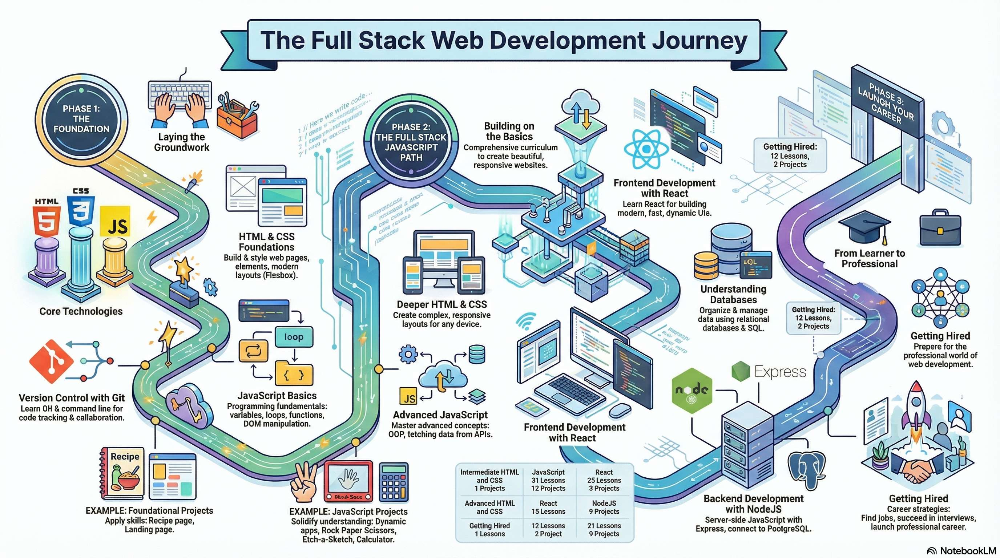

# kintsugi-stack-fullstack-webdev-foundations

> Frontend is pain, backend is pain… but full-stack? That's premium pain.

- Author: [Kintsugi-Programmer](https://github.com/kintsugi-programmer)

> Disclaimer: The content presented here is a curated blend of my personal learning journey, experiences, open-source documentation, and invaluable knowledge gained from diverse sources. I do not claim sole ownership over all the material; this is a community-driven effort to learn, share, and grow together.

## Table of Contents
- [kintsugi-stack-fullstack-webdev-foundations](#kintsugi-stack-fullstack-webdev-foundations)
  - [Table of Contents](#table-of-contents)
  - [Working](#working)
  - [Introduction to Web Development](#introduction-to-web-development)
  - [Resources](#resources)

## Working
- zero to a full-stack developer.
- We will start by getting familiar with the internet and your own computer. Next, we’ll set up a development environment and learn about Git and GitHub. Then, we’ll go over the basics of front-end technologies like HTML, CSS, and JavaScript before stepping into the back end with a brief foray that covers the basic concepts of back-end technologies.
- This section intentionally covers a very broad range of topics. It’s silly to go diving straight into server-side programming without having a context for what it is and why it’s useful (and why you should learn it!).
- The projects are not tests of what you have memorized so far.
- They are practice points where the information will come back to you as you start solving your problems one at a time , relying on Google and Communities for help.
- The truth is that once you complete this curriculum, you will not need a course like this or any sort of “tutorial”.
- The main idea is to teach you the why and change the way you think.
- Mindset: 
  - It isn’t just about coding, 
  - it is about problem-solving, 
  - asking the right questions, 
  - and doing enough research. 
  - Getting into a position where you are comfortable with the skills will mean that you will also be comfortable at expanding your skill-set. 
  - Once you have a solid base, it will be simpler to expand upon it.
- After completing the course you will be in a position where you can simply jump straight into the documentation for anything you are trying to learn. Reading the documentation is the best way to learn any tooling.  
- The skills you will gain from completing This Repo will be the foundation that you will be building upon for years and decades to come. 
- If you come out of the course thinking that you need another course like this one to learn something like Python, then you either don’t believe in yourself or you haven’t taken away the important ideas that are covered in this course.
- The last lesson of this course of [The Odin Project](https://www.theodinproject.com/),It will give you an opportunity to choose between a Full Stack JavaScript and Full Stack Rails path, both designed to further develop the foundation established in this course.
- maintained by professionals
  - We have chosen some of the best resources available  
  - If there are no good resources, we write our own.
  - With that said, know that everything in the curriculum is intentionally included and vital for you to become a successful programmer.
- DO NOT SKIP ANYTHING!
- This Repo is for absolute beginners in the world of web development and those who have tried other resources without success. In reality, This Repo is for anyone who wants to work as a web developer, build a startup, or just hack together a homepage for yourself. 
- We've built an in-depth curriculum designed to take you 100% of the way to becoming a web developer. Many other resources out there teach you just the basics of programming. With This Repo, you'll create your own websites, games, and social media sites.
- The goal of This Repo is to provide a complete path for students to go from zero programming knowledge to employed as web developers while working with other students and picking up the skills to become self sufficient along the way.
- We don't provide a certificate for course completion. Employers will be much more impressed with your amazing personal portfolio of projects, many of which you'll hopefully have built with inspiration from This Repo.

## Introduction to Web Development

- What do web developers do? In short, they build and maintain websites.
- Web developers often work for clients who are trying to get their product or service onto the web. 
- The work is typically project-focused and involves collaborating with a team to coordinate the client’s needs into the end product. 
- The client could be a tech company, an organization, or a government. 
- The work could involve front-end, back-end, or full-stack web development.
  - The front end is the stuff you see on the website in your browser, including the presentation of content and user interface elements like the navigation bar. 
    - Front-end developers use HTML, CSS, JavaScript, and their relevant frameworks to ensure that content is presented effectively and that users have an excellent experience.
  - The back end refers to the guts of the application, which live on the server. 
    - The back end stores and serves program data to ensure that the front end has what it needs. 
    - This process can become very complicated when a website has millions of users. 
    - Back-end developers use programming languages like Java, Python, Ruby, and JavaScript to work with data.
  - Full-stack developers are comfortable working with both the front and back ends. 
    - At This Repo, we focus on teaching you full-stack development, covering all aspects of web development.

- Types of careers
  - Large tech companies, 
    - such as Google, Meta, and Amazon, 
    - have very stringent hiring requirements. 
    - If you successfully meet these expectations, they offer excellent pay, benefits, and opportunities.
  - Startups 
    - are a bit like the wild west. 
    - For a junior developer, it can feel like a trial by fire because of the pace of development. 
    - Startups often offer slightly lower salaries and require longer hours, 
    - but they may also offer equity in the company and highly unique environments.
  - As a freelancer, 
    - you could command a strong hourly wage and 
    - the freedom to schedule and 
    - design your own products. 
    - However, you would be responsible 
      - for getting your own work (which means less coding time), 
      - managing billing from clients (which can be difficult), and 
      - being solely responsible. 
      - Strong people skills are necessary for this path.
  - As a consultant for a web consultancy, 
    - you would give up some of your freelancing wage potential but be 
    - able to focus more on the code and less on the hustle. 
    - This option also provides a good work-life balance and pay.
  - Large older companies 
    - still need web developers. 
    - These companies offer a good work-life balance, pay, and benefits but 
    - often move slower than a company that is highly focused on tech.

- Tools of the trade
  - Computer
  - Google
    - google.com
  - Text Editor
    - https://en.wikipedia.org/wiki/Text_editor
  - Command Line Interface (CLI)
    - https://en.wikipedia.org/wiki/Command-line_interface
  - Stack Overflow
    - http://stackoverflow.com/
  - Git
    - https://git-scm.com/
  - GitHub
    - https://github.com/

## Resources
- [The Odin Project](https://www.theodinproject.com/)

---
End-of-File

The [KintsugiStack](https://github.com/kintsugi-programmer/KintsugiStack) repository, authored by Kintsugi-Programmer, is less a comprehensive resource and more an Artifact of Continuous Research and Deep Inquiry into Computer Science and Software Engineering. It serves as a transparent ledger of the author's relentless pursuit of mastery, from the foundational algorithms to modern full-stack implementation.

> Made with 💚 [Kintsugi-Programmer](https://github.com/kintsugi-programmer)